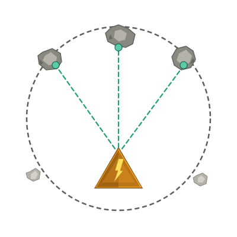

<p align="center">
  
</p>

# Proof of Play

Competitive arcade game with Bitcoin Lightning payments, server-verified scores, and a Nostr audit ledger.

Players pay a small entry fee in sats, compete on leaderboards, and the top scorer wins the prize pool. Practice mode available without login or payment.

## How It Works

1. **Pay** — Lightning invoice for entry (configurable, default 1000 sats = 5 plays). Users with a lightning address get a one-tap wallet deep-link flow.
2. **Play** — Asteroids-style game runs in the browser via deterministic WASM engine. Practice mode available for free (no login required, scores not submitted).
3. **Prove** — Every score is replay-verified server-side before being accepted
4. **Win** — Top scorer wins the prize pool (configurable, default 80% of entry fees). If the winner has a lightning address, the prize is paid out automatically via LNURL — no manual invoice needed.

## Architecture

```
Browser (WASM)                    Server (Axum)
┌──────────────────┐             ┌─────────────────────────┐
│  game_engine     │             │  replay verification    │
│  nostr_signer    │◄──REST────►│  bot detection           │
│  input recorder  │             │  Lightning (LND/LNURL)   │
└──────────────────┘             │  Nostr audit ledger      │
                                 │  SQLite                  │
                                 └─────────────────────────┘
```

| Crate | Target | Description |
|-------|--------|-------------|
| `game_engine` | WASM + native | Deterministic engine: fixed-point math, seeded RNG, replay verification |
| `nostr_signer` | WASM | Nostr key management, NIP-98 HTTP auth |
| `server` | native | Axum: sessions, payments, score verification, prizes, admin dashboard |

## Authentication

Uses **NIP-98 HTTP Auth** — every request is signed fresh with the user's Nostr key. No session tokens, no cookies. Three login methods:

- **Username/password** — generates a Nostr keypair, encrypts the nsec with the password, stores server-side. Recovery via nsec with optional password reset.
- **Nostr extension** — NIP-07 browser extension (Alby, nos2x, etc.)
- **Recovery key** — paste nsec directly, optionally set a new password

## Gameplay

- **Lives**: 3 starting, max 5. Earn extra lives from boss kills.
- **Asteroids**: Split when shot (large → medium → small). Medium only splits into small at higher levels (configurable `min_split_level`, default 3). Points scale by size.
- **Enemies**: Drones (level 3+), Fighters (level 5+, homing), Bombers (level 7+, tanky)
- **Bosses**: Every 5 levels. High HP, scaling difficulty each cycle.
- **Power-ups**: Rapid Fire, Shield, Spread Shot, Speed Boost (drop from enemies)
- **Time bonus**: Clear waves fast for extra points
- **Level phases**: Accumulation → The Halving → Bull Market → Bear Market (repeating)

## Score Integrity

Every score is **replay-verified**: the server replays your recorded inputs through the same deterministic engine and independently derives the score. Fabricated scores, modified clients, and speedhacks are all caught.

Bot detection layers: server-side timing verification, IP analysis, frame timing cross-referencing. All signals stored in `score_metadata` for dashboard monitoring. Admins can ban IPs and users — banned users are excluded from payouts and flagged on the leaderboard.

See [docs/score-integrity.md](docs/score-integrity.md) for full details.

## Lightning Address / LNURL

Users can set a lightning address on their profile for automatic payments:

- **Payouts** — When the competition window closes, the server resolves the winner's lightning address via LNURL-pay (LUD-16), obtains a bolt11 invoice, and pays it automatically. Failed payments can be retried (server verifies with LND before re-attempting to prevent double-pays).
- **Buy-in** — The payment modal auto-triggers a `lightning:` URI to open the user's wallet app, with a QR code fallback.
- **Manual claim** — If a user has no lightning address, or LNURL resolution fails, they can claim prizes from their Profile by pasting a bolt11 invoice (zero-amount or exact-match). Failed claims show as retryable.

Supported formats:
- `user@wallet.com` — Standard lightning address (any LNURL-pay compatible wallet)
- `user@domain:port` — Self-hosted LNURL servers on custom ports
- `$cashtag` — CashApp shorthand, normalized to `cashtag@cash.app`

## Competition

Competitions are configured with a `start_time` (UTC) and `duration_secs`. When the window closes, the server determines the winner and attempts auto-payout. The leaderboard shows the current prize pool.

Prize payment states: `pending` → `paying` → `paid` or `failed` (retryable).

## Setup

```bash
# Build
just build-all           # cargo + WASM

# Configure
cp config/local.example.toml config/local.toml
# Edit with your LND node details

# Run
just run
```

The server auto-creates the SQLite database and runs migrations on startup.

## Regtest (local Lightning testing)

A docker-compose stack for end-to-end testing with real Lightning payments on regtest. Includes bitcoind, two LND nodes (server + player), and a lightning address server for LNURL testing.

```bash
# Start the stack
just regtest-up

# Fund wallets, open channels, export LND creds, verify LNURL
just regtest-setup

# Run with a 5-minute competition window
just regtest-run-quick

# Useful commands
just regtest-mine 6          # mine blocks (confirm payments)
just regtest-lnd1 getinfo    # lncli on server node
just regtest-lnd2 getinfo    # lncli on player node
just regtest-logs -f         # tail logs

# Tear down
just regtest-down             # stop (keep data)
just regtest-clean            # stop + delete volumes
```

After setup, lightning addresses like `player1@localhost:9090` resolve to lnd2 (the player node) — test the full LNURL pay/payout flow locally.

## Deployment

Production deployment uses NixOS on Hetzner with Caddy (auto TLS), WireGuard (admin access), and Backblaze B2 (backups).

See [docs/deployment.md](docs/deployment.md) for full setup guide.

## Admin Dashboard

Available at `/admin` (IP-restricted via config). Features:
- Stats: users, sessions, scores, payments, revenue (gross + house take)
- Today's top scores, recent bot flags, suspicious IPs
- Entry payment and prize payout tables with payment hashes
- Ban management: ban/unban IPs and users with one click
- Competition config display

## Docs

- [docs/deployment.md](docs/deployment.md) — Server setup, secrets, CI/CD
- [docs/score-integrity.md](docs/score-integrity.md) — Replay verification, bot detection, attack vectors

## API

```
GET  /api/v1/health_check              Health check

POST /api/v1/users/login               Nostr NIP-98 login
POST /api/v1/users/register            Register with Nostr key
POST /api/v1/users/username/register   Register with username + password
POST /api/v1/users/username/login      Login with username + password
POST /api/v1/users/reset-password      Reset password (authenticated via nsec)
GET  /api/v1/users/profile             Profile: stats, winnings, lightning address
POST /api/v1/users/lightning-address    Set or clear lightning address

POST /api/v1/game/session              Create game session (402 if unpaid)
GET  /api/v1/game/config               Game config for session
POST /api/v1/game/score                Submit verified score
GET  /api/v1/game/scores/top           Top 10 scores
GET  /api/v1/game/scores/user          User's best scores
GET  /api/v1/game/competition          Competition window + entry fee
GET  /api/v1/game/replays/top          Top replay data
GET  /api/v1/game/replay/{score_id}    Replay data for a specific score

GET  /api/v1/payments/status/{id}      Payment status
POST /api/v1/payments/tip              Create tip invoice

GET  /api/v1/prizes/check              Claimable prizes (pending + failed)
POST /api/v1/prizes/claim              Claim prize (LNURL auto-resolve or bolt11)

GET  /api/v1/ledger/events             Audit events
GET  /api/v1/ledger/pubkey             Server Nostr pubkey
GET  /api/v1/ledger/summary            Ledger stats

POST /admin/ban-ip                     Ban an IP (admin only)
POST /admin/unban-ip                   Unban an IP (admin only)
POST /admin/ban-user                   Ban a user (admin only)
POST /admin/unban-user                 Unban a user (admin only)
```
